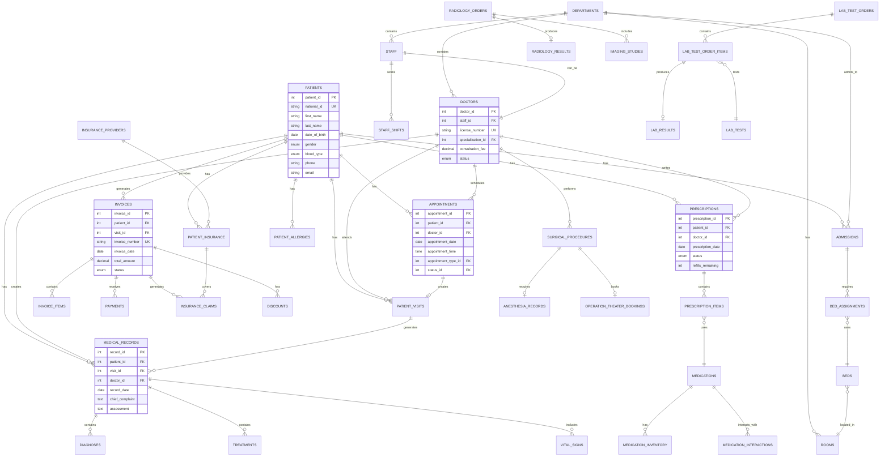

# Healthcare Management System

A comprehensive Healthcare Management System inspired by Saudi German Hospital, built with React, Node.js, and MySQL.

## 🏥 Project Overview

This system manages:
- Patient records and medical history
- Doctor schedules and appointments
- Medical records and prescriptions
- Laboratory tests and diagnostics
- Billing and insurance claims
- Hospital departments and facilities

## 🛠️ Tech Stack

- **Frontend**: React + JavaScript
- **Backend**: Node.js + Express
- **Database**: MySQL (AWS RDS)
- **Authentication**: JWT
- **Deployment**: AWS + GitHub Pages

## 📁 Project Structure

```
Advanced_Healthcare_Mangment_System/
├── database/
│   ├── schema/          # 9 schema files (73 tables)
│   ├── queries/         # SQL queries and views
│   └── databse_Values/  # Seed data for testing
├── backend/             # Node.js API (to be implemented)
├── frontend/            # React application (to be implemented)
└── docs/                # Documentation
```

## 📊 Database Schema

The database consists of **73 tables** organized across 9 functional modules:

- **Patient Management** (12 tables) - Patient data, contacts, insurance, medical history
- **Doctors & Staff** (8 tables) - Staff roles, departments, doctors, schedules
- **Appointments** (6 tables) - Appointment types, scheduling, reminders
- **Medical Records** (13 tables) - Records, diagnoses, treatments, admissions
- **Prescriptions & Pharmacy** (7 tables) - Medications, prescriptions, inventory
- **Laboratory & Diagnostics** (9 tables) - Lab tests, radiology, pathology
- **Billing & Finance** (10 tables) - Invoices, payments, insurance claims
- **Facilities & Operations** (8 tables) - Rooms, beds, equipment, audit logs

### Schema Files

Execute in order:
1. `00_create_database.sql` - Database creation
2. `01_hms_doctors_staff_tables.sql` - Staff and doctors (8 tables)
3. `02_hms_patients_tables.sql` - Patient management (12 tables)
4. `03_hms_appointments_tables.sql` - Appointments (6 tables)
5. `04_hms_medical_records_tables.sql` - Medical records (13 tables)
6. `05_hms_prescriptions_tables.sql` - Prescriptions and pharmacy (7 tables)
7. `06_hms_lab_diagnostics_tables.sql` - Laboratory and diagnostics (9 tables)
8. `07_hms_billing_tables.sql` - Billing and finance (10 tables)
9. `08_hms_facilities_tables.sql` - Facilities and operations (8 tables)

## 📐 Entity Relationship Diagram



### Key Relationships (Chen Notation)

**One-to-Many Relationships:**
- **PATIENTS (1) ──< (M) APPOINTMENTS** - One patient has many appointments
- **PATIENTS (1) ──< (M) MEDICAL_RECORDS** - One patient has many medical records
- **PATIENTS (1) ──< (M) PRESCRIPTIONS** - One patient has many prescriptions
- **PATIENTS (1) ──< (M) INVOICES** - One patient generates many invoices
- **DOCTORS (1) ──< (M) APPOINTMENTS** - One doctor schedules many appointments
- **DOCTORS (1) ──< (M) MEDICAL_RECORDS** - One doctor creates many records
- **DEPARTMENTS (1) ──< (M) STAFF** - One department contains many staff
- **DEPARTMENTS (1) ──< (M) DOCTORS** - One department has many doctors
- **PRESCRIPTIONS (1) ──< (M) PRESCRIPTION_ITEMS** - One prescription has many items
- **INVOICES (1) ──< (M) INVOICE_ITEMS** - One invoice has many items
- **INVOICES (1) ──< (M) PAYMENTS** - One invoice receives many payments
- **ADMISSIONS (1) ──< (M) BED_ASSIGNMENTS** - One admission requires many bed assignments

**Many-to-One Relationships:**
- **PRESCRIPTION_ITEMS (M) ──> (1) MEDICATIONS** - Many items use one medication
- **BED_ASSIGNMENTS (M) ──> (1) BEDS** - Many assignments use one bed
- **BEDS (M) ──> (1) ROOMS** - Many beds located in one room

**One-to-One Relationships:**
- **STAFF (1) ── (1) DOCTORS** - One staff member can be one doctor
- **APPOINTMENTS (1) ── (1) PATIENT_VISITS** - One appointment creates one visit
- **LAB_TEST_ORDER_ITEMS (1) ── (1) LAB_RESULTS** - One order item produces one result

## 🔐 Security Features

- JWT-based authentication
- Password hashing with bcrypt
- Input validation and sanitization
- SQL injection prevention
- CORS configuration
- Role-based access control

## 📝 License

This project is for educational purposes.

## 👥 Contributors

- [Peter Ashak]

---

**Status**: In Development 🚧
