# Healthcare Management System

<div align="center">

**Enterprise-Grade Healthcare Management System**

*Streamlining hospital operations, patient care, and administrative workflows*

[]()
[]()
[]()
[]()

</div>

---

## 📋 Table of Contents

- [Project Overview](#-project-overview)
- [System Architecture](#-system-architecture)
- [Core Capabilities](#-core-capabilities)
- [Technology Stack](#-technology-stack)
- [Database Architecture](#-database-architecture)
  - [Database Normalization](#-database-normalization)
- [Security & Compliance](#-security--compliance)
- [Project Structure](#-project-structure)
- [Key Features](#-key-features)
- [Documentation](#-documentation)

---

## 🏥 Project Overview

The Healthcare Management System is a comprehensive, enterprise-grade full-stack application designed to digitize and automate core hospital operations. The system provides healthcare professionals with integrated tools to efficiently manage patient care, clinical workflows, and administrative functions while ensuring data integrity, security, and compliance with healthcare standards.

### System Purpose

- **Digital Transformation**: Complete digitization of hospital operations from patient registration to billing
- **Operational Efficiency**: Streamlined workflows reducing administrative overhead
- **Data Integrity**: Enterprise-grade database design ensuring accurate and consistent data
- **Compliance Ready**: Architecture designed to support healthcare data compliance requirements

---

## 🏗️ System Architecture

### High-Level Architecture

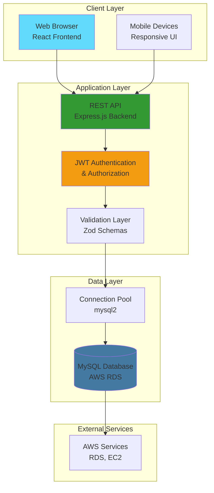

### Application Flow

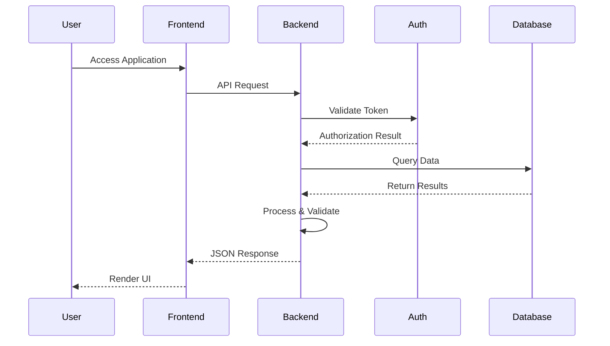

---

## 🎯 Core Capabilities

### Patient Management
- Patient registration and profile management
- Medical history tracking and documentation
- Insurance and billing integration
- Emergency contact and document management

### Clinical Operations
- Electronic medical records (EMR)
- Appointment scheduling and management
- Prescription management with pharmacy integration
- Laboratory test ordering and results tracking
- Radiology and diagnostic imaging management
- Surgical procedure documentation

### Administrative Functions
- Staff and doctor management with role-based access control
- Department and facility organization
- Billing, invoicing, and payment processing
- Insurance claim management
- Equipment and inventory tracking
- Comprehensive audit logging and compliance reporting

### AI-Powered Patient Assistant
- Intelligent chatbot with natural language processing
- 24/7 automated appointment booking assistance
- Medical guidance and symptom-based doctor recommendations
- Bilingual support (English/Arabic)
- Seamless integration with appointment scheduling system

---

## 🛠️ Technology Stack

### Frontend
| Component | Technology |
|-----------|-----------|
| Framework | React 18+ with TypeScript |
| State Management | React Context API |
| Routing | React Router v6 |
| Styling | CSS3 (Responsive Design) |
| Build Tool | Vite |
| Hosting | Vercel / AWS EC2 |

### Backend
| Component | Technology |
|-----------|-----------|
| Runtime | Node.js |
| Framework | Express.js |
| Language | TypeScript |
| Authentication | JWT (JSON Web Tokens) |
| Validation | Zod Schema Validation |
| Error Handling | Centralized Middleware |

### Database
| Component | Technology |
|-----------|-----------|
| Engine | MySQL 8.0+ |
| Hosting | Amazon RDS for MySQL |
| Connection | Connection Pooling (mysql2) |
| Security | SSL/TLS Encryption |
| Normalization | BCNF/4NF/5NF Compliant |

### AI & Machine Learning
| Component | Technology |
|-----------|-----------|
| AI Provider | Groq AI |
| Model | Llama 3.3 70B Versatile |
| NLP | Natural Language Processing |
| Approach | Hybrid (AI + Rule-Based) |

### Infrastructure
- **Cloud Provider**: Amazon Web Services (AWS)
- **Database**: AWS RDS for MySQL
- **Version Control**: Git
- **Package Management**: npm

---

## 📊 Database Architecture

### Database Overview

The system utilizes a highly normalized relational database consisting of **73 tables** organized across **9 functional modules**. The database is designed with enterprise-grade normalization standards (BCNF/4NF/5NF) to ensure data integrity, minimize redundancy, and optimize query performance.

### Database Modules

```mermaid
graph LR
    subgraph "Database Modules"
        A[Doctors & Staff<br/>8 tables]
        B[Patient Management<br/>12 tables]
        C[Appointments<br/>6 tables]
        D[Medical Records<br/>13 tables]
        E[Prescriptions<br/>7 tables]
        F[Lab & Diagnostics<br/>9 tables]
        G[Billing & Finance<br/>10 tables]
        H[Facilities<br/>8 tables]
    end
    
    A --> B
    B --> C
    C --> D
    D --> E
    E --> F
    F --> G
    G --> H
    
    style A fill:#e74c3c
    style B fill:#3498db
    style C fill:#2ecc71
    style D fill:#f39c12
    style E fill:#9b59b6
    style F fill:#1abc9c
    style G fill:#e67e22
    style H fill:#34495e
```

### Entity Relationship Diagram

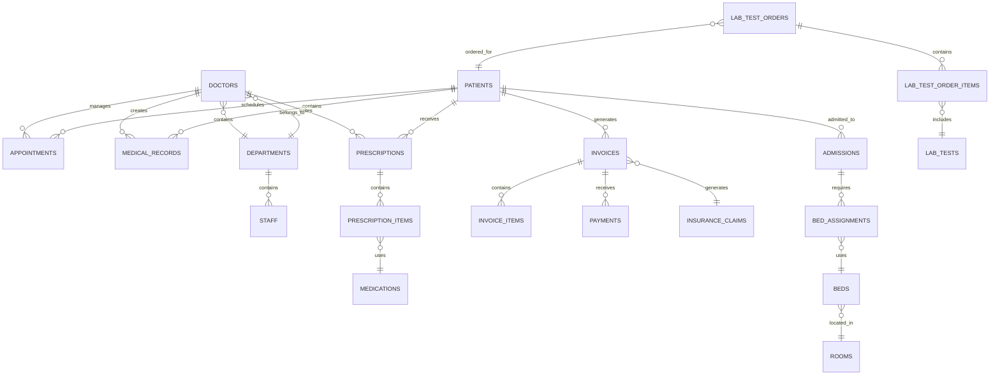

### Database Normalization

The database schema achieves **Boyce-Codd Normal Form (BCNF)** with most tables reaching **4th Normal Form (4NF)** and some achieving **5th Normal Form (5NF)**. This section provides a comprehensive overview of the normalization levels implemented in the system.

#### Normalization Progression

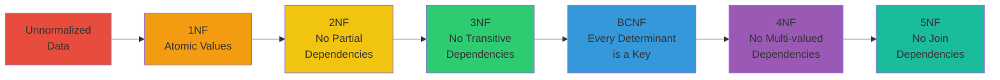

#### First Normal Form (1NF) ✅

**Requirement**: All attributes contain atomic (indivisible) values, and each row is uniquely identified.

**Implementation Examples:**

**Before 1NF (Violation):**
```
patients table with repeating groups:
┌─────────────┬──────────────┬─────────────────────────────┐
│ patient_id  │ name         │ allergies                   │
├─────────────┼──────────────┼─────────────────────────────┤
│ 1           │ John Doe     │ Penicillin, Aspirin, Nuts   │
└─────────────┴──────────────┴─────────────────────────────┘
```

**After 1NF (Compliant):**
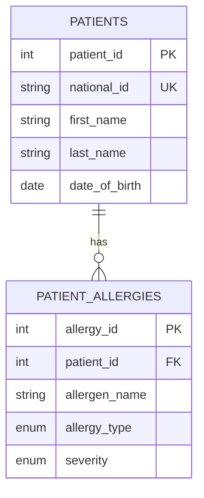

**Real Schema Example:**
- `patients` table: Each attribute contains atomic values (no arrays or lists)
- `patient_allergies` table: Separate table for multiple allergies per patient
- `patient_contacts` table: Separate table for multiple contact methods

#### Second Normal Form (2NF) ✅

**Requirement**: Must satisfy 1NF, and all non-key attributes must be fully functionally dependent on the primary key.

**Implementation Examples:**

**Before 2NF (Violation):**
```
appointments table with partial dependency:
┌─────────────┬──────────────┬──────────────┬──────────────┐
│ appointment │ patient_id   │ patient_name │ doctor_id    │
│ _id (PK)    │ (PK)         │              │              │
└─────────────┴──────────────┴──────────────┴──────────────┘
❌ patient_name depends only on patient_id, not full PK
```

**After 2NF (Compliant):**
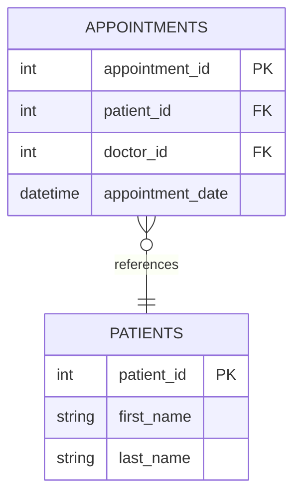

**Real Schema Example:**
- `appointments` table: References `patients` via foreign key instead of storing patient name
- `prescriptions` table: References `patients` and `doctors` via foreign keys
- All composite keys ensure full functional dependency

#### Third Normal Form (3NF) ✅

**Requirement**: Must satisfy 2NF, and no transitive dependencies (non-key attributes don't depend on other non-key attributes).

**Implementation Examples:**

**Before 3NF (Violation):**
```
staff table with transitive dependency:
┌──────────┬──────────────┬──────────────┬──────────────┐
│ staff_id │ department_id│ dept_name    │ dept_location│
│ (PK)     │              │              │              │
└──────────┴──────────────┴──────────────┴──────────────┘
❌ dept_name and dept_location depend on department_id, not staff_id
```

**After 3NF (Compliant):**
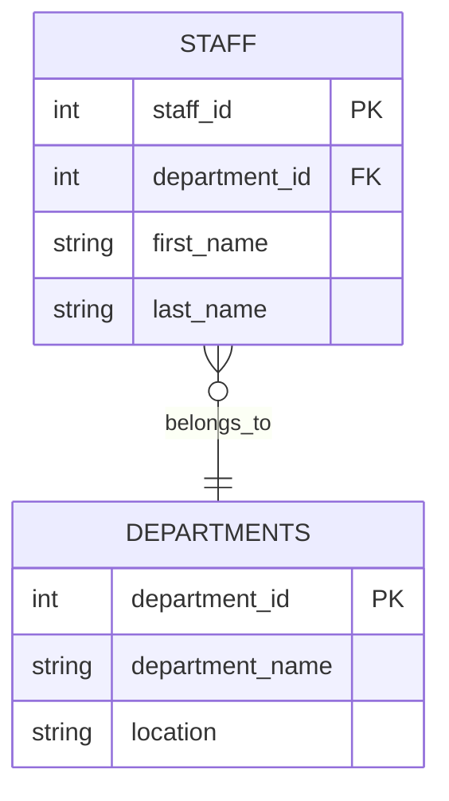

**Real Schema Example:**
- `staff` table: References `departments` table instead of storing department details
- `doctors` table: References `doctor_specialties` table instead of storing specialty details
- `patient_insurance` table: References `insurance_providers` table instead of storing provider details

#### Boyce-Codd Normal Form (BCNF) ✅

**Requirement**: Must satisfy 3NF, and every determinant (attribute that determines another) must be a candidate key.

**Implementation Examples:**

**BCNF Compliance Diagram:**
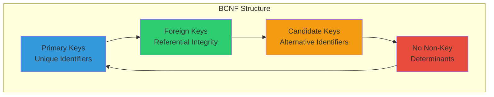

**Real Schema Examples:**
- `patients` table: `national_id` is a unique candidate key, ensuring no non-key determinants
- `doctors` table: `license_number` is unique, preventing dependency issues
- `staff` table: `employee_id` is unique, ensuring proper key relationships
- All foreign key relationships properly enforce referential integrity

#### Fourth Normal Form (4NF) ✅

**Requirement**: Must satisfy BCNF, and no multi-valued dependencies (independent multi-valued attributes).

**Implementation Examples:**

**Before 4NF (Violation):**
```
prescriptions table with multi-valued dependency:
┌──────────────┬──────────────┬──────────────┐
│ prescription │ medication_id │ doctor_id    │
│ _id (PK)     │ (MVD)        │ (MVD)        │
└──────────────┴──────────────┴──────────────┘
❌ Multiple medications and doctors independently related
```

**After 4NF (Compliant):**
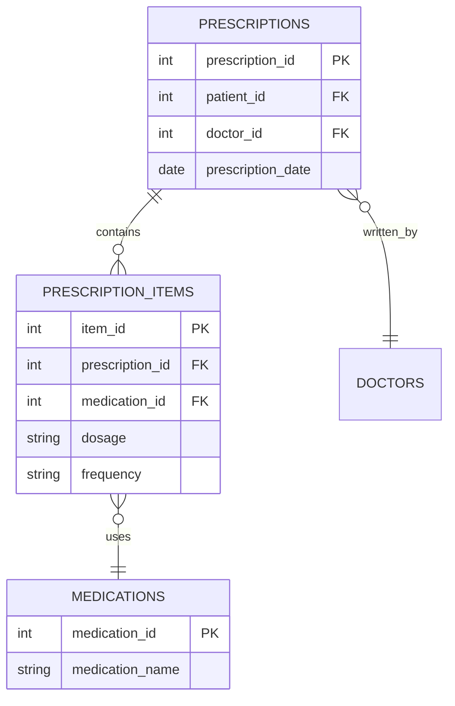

**Real Schema Examples:**
- `prescription_items` junction table: Resolves many-to-many between `prescriptions` and `medications`
- `lab_test_order_items` junction table: Resolves many-to-many between `lab_test_orders` and `lab_tests`
- `invoice_items` table: Properly handles multiple services per invoice

#### Fifth Normal Form (5NF) ✅

**Requirement**: Must satisfy 4NF, and no join dependencies that can be decomposed further without loss.

**Implementation Examples:**

**5NF Compliance Structure:**
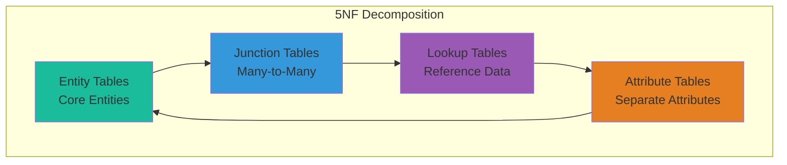

**Real Schema Examples:**
- `patient_contacts`, `patient_allergies`, `patient_insurance`: Separate attribute tables for patient data
- `doctor_qualifications`: Separate table for multiple qualifications per doctor
- `doctor_schedules`: Separate table for multiple schedule entries per doctor
- All relationships properly decomposed to eliminate join dependencies

#### Normalization Benefits

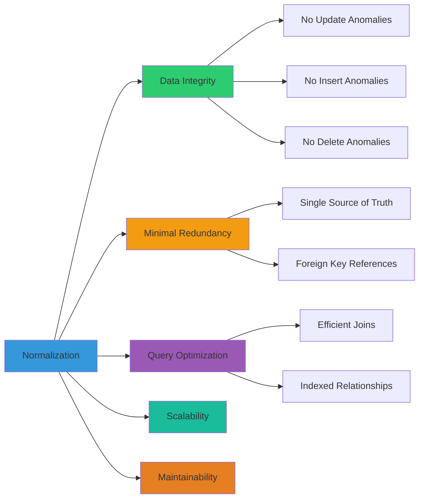

**Key Benefits:**
- ✅ **Data Integrity**: Eliminates update, insertion, and deletion anomalies
- ✅ **Minimal Redundancy**: Single source of truth with foreign key references
- ✅ **Query Optimization**: Efficient data retrieval through well-structured relationships
- ✅ **Scalability**: Normalized structure supports future growth
- ✅ **Maintainability**: Clear separation of concerns simplifies maintenance

#### Normalization Design Patterns

**1. Entity Separation Pattern**
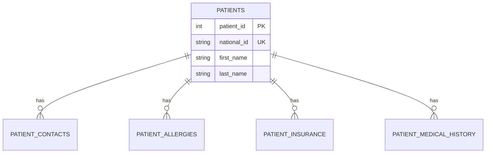

**2. Lookup Tables Pattern**
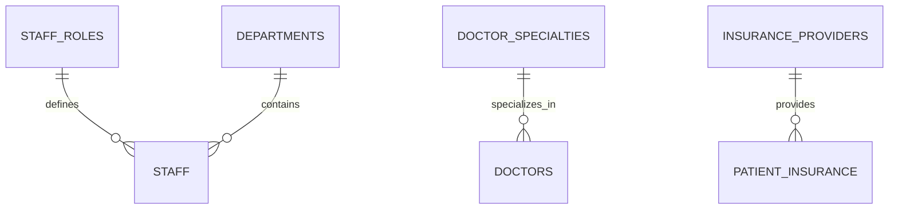

**3. Junction Tables Pattern**
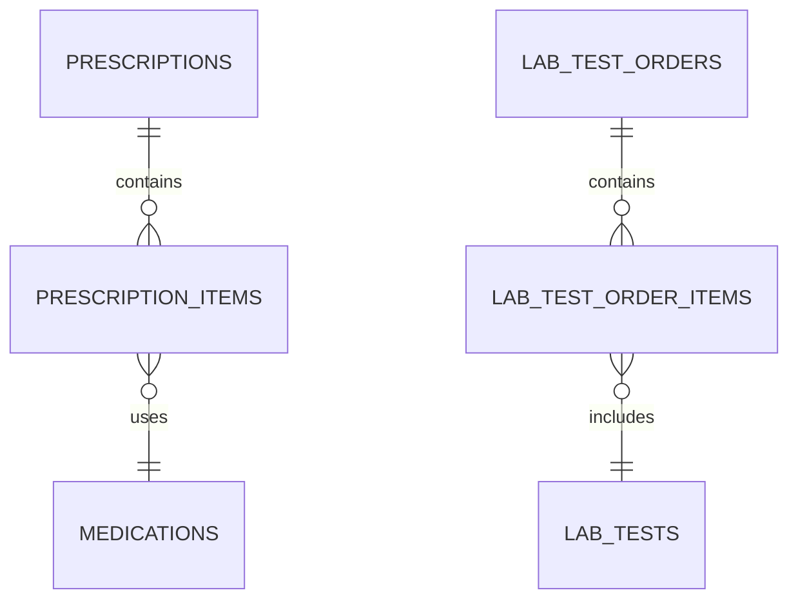

**4. Referential Integrity Pattern**
- All foreign keys have `ON DELETE CASCADE` or `ON DELETE RESTRICT` constraints
- Foreign keys are indexed for performance
- Unique constraints prevent duplicate relationships

For detailed schema documentation, see [`database/schema/README.md`](./database/schema/README.md).

---

## 🔐 Security & Compliance

### Security Architecture

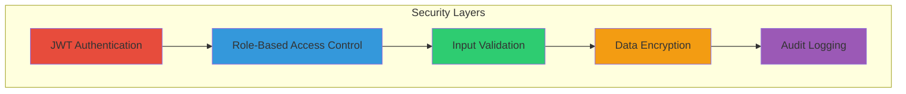

### Security Features

**Authentication & Authorization**
- JWT-based token authentication
- Role-Based Access Control (RBAC) with 7 user roles
- Secure session management with token expiration
- Password hashing ready for production

**Data Protection**
- Comprehensive input validation using Zod schemas
- SQL injection prevention through parameterized queries
- XSS protection with input sanitization
- CORS configuration for controlled cross-origin access
- SSL/TLS encryption for database connections

**Compliance & Auditing**
- HIPAA-ready architecture
- Comprehensive audit trails for all user actions
- Role-based data isolation
- Complete logging of data modifications

---

## 📁 Project Structure

```
Advanced_Healthcare_Mangment_System/
├── database/
│   ├── schema/              # 9 schema files (73 tables)
│   ├── queries/             # SQL queries, views, procedures
│   ├── databse_Values/      # Seed data
│   └── README.md            # Database documentation
├── backend/
│   ├── src/
│   │   ├── config/          # Database & app configuration
│   │   ├── controllers/     # Request handlers
│   │   ├── middleware/      # Auth, validation, error handling
│   │   ├── routes/          # API route definitions
│   │   ├── services/        # Business logic
│   │   ├── types/           # TypeScript definitions
│   │   ├── validators/      # Zod validation schemas
│   │   └── server.ts        # Application entry point
│   └── package.json
├── frontend/
│   ├── src/
│   │   ├── components/      # Reusable UI components
│   │   ├── pages/           # Page components
│   │   ├── context/         # React context providers
│   │   ├── services/        # API service layer
│   │   ├── types/           # TypeScript definitions
│   │   └── App.tsx          # Main application
│   └── package.json
└── README.md
```

### Module Interaction

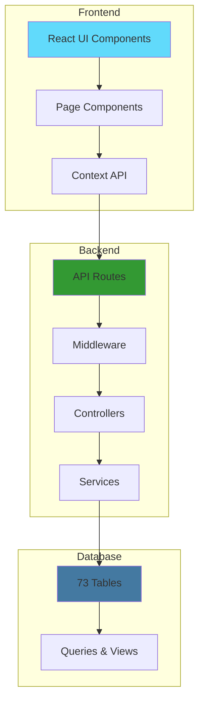

---

## 🎯 Key Features

### Core Functionality

| Feature | Description |
|---------|-------------|
| **Patient Management** | Complete patient lifecycle from registration to discharge |
| **Electronic Medical Records** | Digital documentation of all patient interactions |
| **Appointment Scheduling** | Flexible scheduling system with automated reminders |
| **Prescription Management** | Digital prescriptions with medication tracking |
| **Laboratory Integration** | Lab test ordering and results management |
| **Billing & Insurance** | Automated invoicing and insurance claim processing |
| **Multi-Role Access** | Role-based dashboards for 7 different user types |
| **AI-Powered Chatbot** | Intelligent patient assistant with natural language understanding |
| **Audit Logging** | Complete audit trail for compliance and security |
| **Cloud-Ready** | Designed for AWS deployment with RDS integration |

### User Roles

- **Administrator**: Full system access and management
- **Doctor**: Patient care, medical records, prescriptions
- **Nurse**: Patient care and record updates
- **Lab Technician**: Laboratory test management
- **Pharmacist**: Prescription and medication management
- **Receptionist**: Appointment and patient registration
- **Radiologist**: Diagnostic imaging management

### AI-Powered Chatbot

The system includes an intelligent patient assistant chatbot that provides 24/7 automated support for patients. The chatbot leverages **Groq AI** with the Llama 3.3 70B model for natural language understanding, combined with rule-based logic for reliable appointment booking.

**Key Capabilities:**
- **Natural Language Processing**: Understands patient queries in conversational language
- **Appointment Booking**: Automated appointment scheduling with doctor availability checking
- **Medical Guidance**: Symptom-based doctor recommendations with appropriate medical disclaimers
- **Bilingual Support**: Seamless English and Arabic language support
- **Smart Fallbacks**: Graceful degradation to rule-based responses if AI is unavailable
- **Context Awareness**: Integrates with real-time doctor availability and patient data

**Architecture:**
- **Frontend**: React-based chat interface with real-time message handling
- **Backend**: Hybrid AI + rule-based processing for optimal reliability
- **Integration**: Seamless navigation to appointment booking with pre-filled data
- **Security**: Patient-authenticated endpoints ensuring data privacy

The chatbot enhances patient experience by providing instant assistance, reducing administrative burden, and enabling patients to book appointments through natural conversation.

---

## 📚 Documentation

- **Database Schema**: [`database/schema/README.md`](./database/schema/README.md) - Detailed schema documentation
- **API Documentation**: [`backend/README.md`](./backend/README.md) - API endpoints and usage
- **Frontend Documentation**: [`frontend/README.md`](./frontend/README.md) - Frontend architecture and components
- **Database README**: [`database/README.md`](./database/README.md) - Database setup and configuration

---

## 👥 Contributors

- **Peter Ashak** - Project Lead & Developer

---

<div align="center">

**Project Status**: 🚧 In Active Development

**Last Updated**: 2024

---

*This project is for educational purposes.*

</div>
