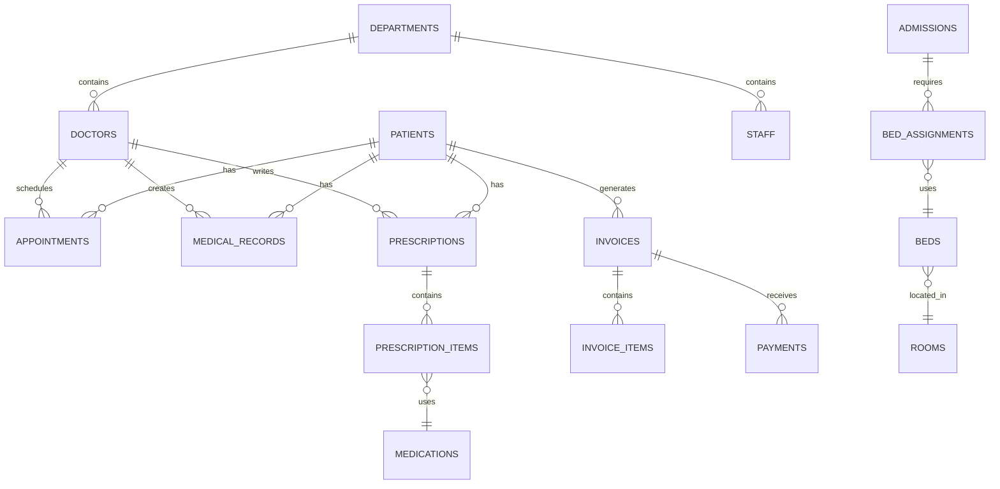

# Healthcare Management System

A comprehensive Healthcare Management System inspired by Saudi German Hospital, built with React, Node.js, and MySQL.

## 🏥 Project Overview

This system manages:
- Patient records and medical history
- Doctor schedules and appointments
- Medical records and prescriptions
- Laboratory tests and diagnostics
- Billing and insurance claims
- Hospital departments and facilities

## 🛠️ Tech Stack

- **Frontend**: React + JavaScript
- **Backend**: Node.js + Express
- **Database**: MySQL (AWS RDS)
- **Authentication**: JWT
- **Deployment**: AWS + GitHub Pages

## 📁 Project Structure

```
Advanced_Healthcare_Mangment_System/
├── database/
│   ├── schema/          # 9 schema files (73 tables)
│   ├── queries/         # SQL queries and views
│   └── databse_Values/  # Seed data for testing
├── backend/             # Node.js API (to be implemented)
├── frontend/            # React application (to be implemented)
└── docs/                # Documentation
```

## 📊 Database Schema

The database consists of **73 tables** organized across 9 functional modules. See `database/schema/README.md` for detailed schema documentation.

### Entity Relationship Diagram



## 🔐 Security Features

- JWT-based authentication
- Password hashing with bcrypt
- Input validation and sanitization
- SQL injection prevention
- CORS configuration
- Role-based access control

## 📝 License

This project is for educational purposes.

## 👥 Contributors

- [Peter Ashak]

---

**Status**: In Development 🚧
