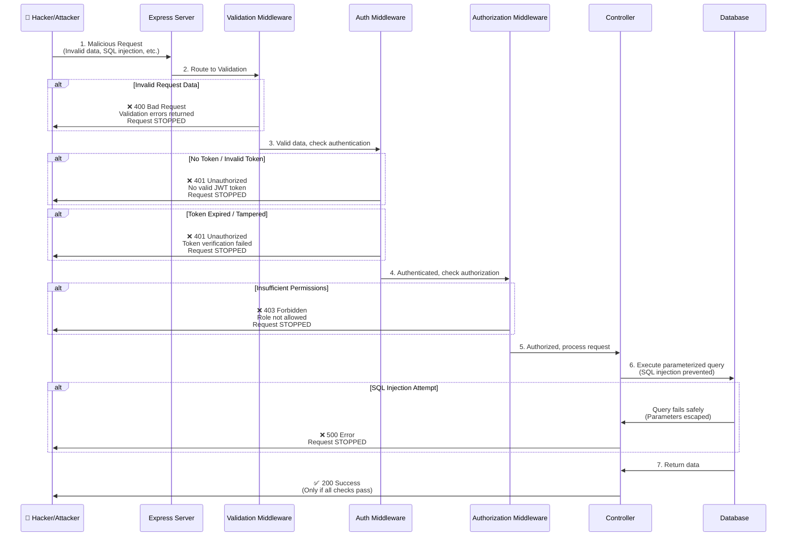

# Healthcare Management System - Backend API

TypeScript backend API built with Express, MySQL, and JWT authentication. Implements role-based access control, request validation, and comprehensive error handling.

## Architecture Overview

```
┌─────────────────────────────────────────────────────────────────┐
│                         HTTP Request                            │
└────────────────────────────┬────────────────────────────────────┘
                             │
                             ▼
┌─────────────────────────────────────────────────────────────────┐
│                    Express Server (server.ts)                    │
│  • CORS Configuration                                            │
│  • JSON/URL-encoded Parsing                                     │
│  • Route Registration                                            │
└────────────────────────────┬────────────────────────────────────┘
                             │
                             ▼
┌─────────────────────────────────────────────────────────────────┐
│                      Route Layer (routes/)                       │
│  • Endpoint Definitions                                          │
│  • Middleware Chain Assembly                                     │
└────────────────────────────┬────────────────────────────────────┘
                             │
                             ▼
┌─────────────────────────────────────────────────────────────────┐
│                   Validation Middleware                          │
│  • Zod Schema Validation (validators/)                          │
│  • Request Body/Query/Params Validation                         │
│  • Type Coercion & Transformation                               │
└────────────────────────────┬────────────────────────────────────┘
                             │
                             ▼
┌─────────────────────────────────────────────────────────────────┐
│                   Authentication Middleware                      │
│  • JWT Token Verification                                        │
│  • User Context Injection                                        │
└────────────────────────────┬────────────────────────────────────┘
                             │
                             ▼
┌─────────────────────────────────────────────────────────────────┐
│                   Authorization Middleware                       │
│  • Role-based Access Control                                     │
│  • Permission Checking                                           │
└────────────────────────────┬────────────────────────────────────┘
                             │
                             ▼
┌─────────────────────────────────────────────────────────────────┐
│                    Controller Layer                              │
│  • Business Logic (controllers/)                                 │
│  • Database Queries                                              │
│  • Response Formatting                                           │
└────────────────────────────┬────────────────────────────────────┘
                             │
                             ▼
┌─────────────────────────────────────────────────────────────────┐
│                    Database Layer                                │
│  • MySQL Connection Pool (config/database.ts)                   │
│  • Query Execution                                               │
└────────────────────────────┬────────────────────────────────────┘
                             │
                             ▼
┌─────────────────────────────────────────────────────────────────┐
│                    Error Handler                                 │
│  • Global Error Middleware                                       │
│  • 404 Not Found Handler                                         │
│  • Error Response Formatting                                     │
└─────────────────────────────────────────────────────────────────┘
```

## Security Flow: How Malicious Requests Are Stopped



## Directory Structure

```
backend/
├── src/
│   ├── config/
│   │   └── database.ts          # MySQL connection pool configuration
│   │
│   ├── routes/                   # API endpoint definitions
│   │   ├── auth.routes.ts        # Authentication endpoints
│   │   ├── patient.routes.ts     # Patient CRUD endpoints
│   │   ├── doctor.routes.ts      # Doctor endpoints
│   │   └── appointment.routes.ts # Appointment endpoints
│   │
│   ├── controllers/              # Business logic handlers
│   │   ├── auth.controller.ts     # Login, user info
│   │   ├── patient.controller.ts # Patient operations
│   │   ├── doctor.controller.ts   # Doctor operations
│   │   └── appointment.controller.ts # Appointment operations
│   │
│   ├── middleware/               # Request processing middleware
│   │   ├── auth.middleware.ts    # JWT authentication & role authorization
│   │   ├── validation.middleware.ts # Zod validation wrapper
│   │   └── error.middleware.ts   # Global error handling
│   │
│   ├── validators/               # Zod validation schemas
│   │   ├── auth.validator.ts     # Login validation
│   │   ├── patient.validator.ts  # Patient data validation
│   │   ├── doctor.validator.ts   # Doctor query validation
│   │   └── appointment.validator.ts # Appointment validation
│   │
│   ├── types/                    # TypeScript type definitions
│   │   ├── patient.types.ts      # Patient interfaces
│   │   ├── doctor.types.ts       # Doctor interfaces
│   │   └── appointment.types.ts  # Appointment interfaces
│   │
│   └── server.ts                 # Express app initialization
│
├── .env.example                  # Environment variables template
├── tsconfig.json                 # TypeScript configuration
├── package.json                  # Dependencies & scripts
└── README.md                     # This file
```

## Request Processing Flow

### 1. **Route Registration** (`server.ts`)
- Express app configured with CORS, JSON parsing
- Routes mounted: `/api/auth`, `/api/patients`, `/api/doctors`, `/api/appointments`
- Error handlers registered last

### 2. **Validation Layer** (`validators/` + `validation.middleware.ts`)
- **Purpose**: Validate request data before processing
- **Schemas**: Zod schemas define allowed data types, formats, constraints
- **Actions**: 
  - Validates body, query params, route params
  - Transforms data (e.g., string to number)
  - Returns 400 with detailed errors if validation fails

### 3. **Authentication Layer** (`auth.middleware.ts`)
- **Purpose**: Verify user identity
- **Process**:
  1. Extract JWT token from `Authorization: Bearer <token>` header
  2. Verify token signature and expiration
  3. Decode user info (staff_id, role_id, email)
  4. Fetch role_name from database
  5. Attach user object to `req.user`
- **Failure**: Returns 401 Unauthorized

### 4. **Authorization Layer** (`auth.middleware.ts`)
- **Purpose**: Check user permissions
- **Usage**: `authorize('Admin', 'Doctor')` - allows only specified roles
- **Process**:
  1. Check if user exists (must be authenticated first)
  2. Verify user's role_name is in allowed roles list
  3. Continue if authorized
- **Failure**: Returns 403 Forbidden

### 5. **Controller Layer** (`controllers/`)
- **Purpose**: Execute business logic
- **Responsibilities**:
  - Build SQL queries with parameterized values (prevents SQL injection)
  - Execute database operations
  - Format responses
  - Handle business errors

### 6. **Database Layer** (`config/database.ts`)
- **Connection Pool**: Manages MySQL connections efficiently
- **Parameterized Queries**: All queries use `?` placeholders (SQL injection prevention)
- **Error Handling**: Database errors caught and handled gracefully

### 7. **Error Handling** (`error.middleware.ts`)
- **Global Handler**: Catches all unhandled errors
- **404 Handler**: Returns 404 for undefined routes
- **Format**: Consistent error response structure

## Security Features

### 1. **Input Validation (Zod)**
- Validates all incoming data types, formats, constraints
- Prevents malformed data from reaching controllers
- Returns detailed validation errors

### 2. **JWT Authentication**
- Token-based authentication
- Tokens include: staff_id, role_id, email
- Token expiration enforced
- Secret key from environment variables

### 3. **Role-Based Access Control (RBAC)**
- Roles: Admin, Doctor, Nurse, Lab Technician, Pharmacist, Receptionist, Radiologist, Accountant
- Middleware checks user role before allowing access
- Flexible: Multiple roles can access same endpoint

### 4. **SQL Injection Prevention**
- All queries use parameterized statements (`?` placeholders)
- User input never directly concatenated into SQL
- Database driver handles escaping automatically

### 5. **Error Handling**
- No sensitive information leaked in error messages
- Consistent error response format
- Stack traces only in development mode

## API Endpoints

### Authentication
- `POST /api/auth/login` - User login (returns JWT token)
- `GET /api/auth/me` - Get current user (requires authentication)

### Patients
- `GET /api/patients` - List patients (pagination, search, status filter)
- `GET /api/patients/:id` - Get patient by ID
- `POST /api/patients` - Create patient (validated)
- `PUT /api/patients/:id` - Update patient (whitelisted fields)
- `DELETE /api/patients/:id` - Soft delete patient

### Doctors
- `GET /api/doctors` - List doctors (pagination, search, status filter)
- `GET /api/doctors/:id` - Get doctor with full details

### Appointments
- `GET /api/appointments` - List appointments (filters: doctor_id, patient_id, date)
- `GET /api/appointments/:id` - Get appointment by ID
- `POST /api/appointments` - Create appointment (validated)

## Example: Protected Route with Authorization

```typescript
// In routes/patient.routes.ts
router.delete(
  '/:id',
  validateParams(patientIdSchema),      // 1. Validate ID format
  authenticate,                          // 2. Check authentication
  authorize('Admin', 'Receptionist'),    // 3. Check role permissions
  deletePatient                          // 4. Execute controller
);
```

**Flow:**
1. Validation: Ensures ID is a valid number
2. Authentication: Verifies JWT token, loads user
3. Authorization: Checks if user role is 'Admin' or 'Receptionist'
4. Controller: Executes deletion if all checks pass

## Type Safety

- **TypeScript Types** (`types/`): Define data structures for compile-time checking
- **Zod Validators** (`validators/`): Validate data at runtime
- **Together**: Types help during development, validators protect the API

## Development

```bash
# Install dependencies
npm install

# Run development server (with auto-reload)
npm run dev

# Build for production
npm run build

# Start production server
npm start
```

## Environment Variables

### Required in `.env`:

#### Server Configuration
- `PORT` - Server port (default: 5000)
- `NODE_ENV` - Environment (development/production)

#### AWS RDS MySQL Database Configuration
- `DB_HOST` - AWS RDS endpoint (e.g., `your-db.xxxxx.us-east-1.rds.amazonaws.com`)
- `DB_PORT` - Database port (default: 3306)
- `DB_USER` - Database username (e.g., `admin`)
- `DB_PASSWORD` - Database password
- `DB_NAME` - Database name (default: `Peter_healthcare_management_system`)

#### Database Connection Pool Settings (Optional)
- `DB_CONNECTION_LIMIT` - Maximum number of connections in pool (default: 10)
- `DB_CONNECT_TIMEOUT` - Connection timeout in milliseconds (default: 60000)

#### SSL Configuration for AWS RDS (Recommended)
- `DB_SSL` - Enable SSL connection (`true` or `1` for enabled, `false` or `0` for disabled)
- `DB_SSL_REJECT_UNAUTHORIZED` - Reject unauthorized SSL certificates (default: `true`)

#### JWT Configuration
- `JWT_SECRET` - Secret key for JWT signing (use a strong random string)
- `JWT_EXPIRE` - Token expiration (e.g., "7d", "24h", "1h")

### Example `.env` file:

```env
# Server Configuration
PORT=5000
NODE_ENV=development

# AWS RDS MySQL Database Configuration
DB_HOST=healthcare-db.xxxxx.us-east-1.rds.amazonaws.com
DB_PORT=3306
DB_USER=admin
DB_PASSWORD=your-secure-password-here
DB_NAME=Peter_healthcare_management_system

# Database Connection Pool Settings
DB_CONNECTION_LIMIT=10
DB_CONNECT_TIMEOUT=60000

# SSL Configuration for AWS RDS
DB_SSL=true
DB_SSL_REJECT_UNAUTHORIZED=true

# JWT Configuration
JWT_SECRET=your-super-secret-jwt-key-change-this-in-production
JWT_EXPIRE=7d
```

### AWS RDS Setup

This backend is configured to work with **Amazon RDS for MySQL**. See the main project `README.md` for detailed AWS RDS setup instructions.

**Quick Setup Checklist:**
1. ✅ Create RDS MySQL instance in AWS Console
2. ✅ Configure security group to allow port 3306
3. ✅ Copy RDS endpoint to `DB_HOST` in `.env`
4. ✅ Set `DB_USER` and `DB_PASSWORD` from RDS configuration
5. ✅ Enable SSL: Set `DB_SSL=true` (recommended)
6. ✅ Initialize database schema from `../database/schema/` files
7. ✅ Test connection: `npm run dev` and check `/api/test-db` endpoint
