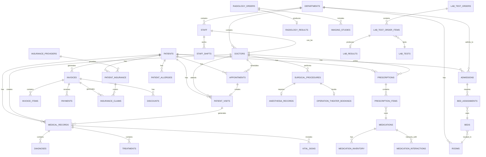

# Database Schema

Healthcare Management System database schema with 73 tables organized across 9 functional modules.

## Schema Files

Execute in order:

1. `00_create_database.sql` - Database creation
2. `01_hms_doctors_staff_tables.sql` - Staff and doctors (8 tables)
3. `02_hms_patients_tables.sql` - Patient management (12 tables)
4. `03_hms_appointments_tables.sql` - Appointments (6 tables)
5. `04_hms_medical_records_tables.sql` - Medical records (13 tables)
6. `05_hms_prescriptions_tables.sql` - Prescriptions and pharmacy (7 tables)
7. `06_hms_lab_diagnostics_tables.sql` - Laboratory and diagnostics (9 tables)
8. `07_hms_billing_tables.sql` - Billing and finance (10 tables)
9. `08_hms_facilities_tables.sql` - Facilities and operations (8 tables)

## Table Structure

### Doctors & Staff (8 tables)
- `staff_roles` - Staff role definitions
- `departments` - Hospital departments
- `staff` - Staff members
- `doctor_specialties` - Medical specialties
- `doctors` - Doctor profiles
- `doctor_qualifications` - Doctor qualifications
- `doctor_schedules` - Doctor schedules
- `staff_shifts` - Staff shift assignments

### Patient Management (12 tables)
- `patients` - Patient master data
- `patient_contacts` - Patient contact information
- `insurance_providers` - Insurance companies
- `patient_insurance` - Patient insurance policies
- `patient_medical_history` - Medical history records
- `patient_allergies` - Patient allergies
- `patient_emergency_contacts` - Emergency contacts
- `patient_documents` - Patient documents
- `patient_visits` - Patient visit records

### Appointments (6 tables)
- `appointment_types` - Appointment type definitions
- `appointment_status` - Appointment status codes
- `time_slots` - Available time slots
- `appointments` - Appointment records
- `appointment_reminders` - Appointment reminders
- `doctor_availability` - Doctor availability calendar

### Medical Records (13 tables)
- `medical_records` - Medical record entries
- `diagnoses` - Diagnosis records
- `treatments` - Treatment records
- `treatment_plans` - Treatment plans
- `vital_signs` - Vital signs measurements
- `clinical_notes` - Clinical notes
- `progress_notes` - Progress notes
- `admissions` - Patient admissions
- `discharge_summaries` - Discharge summaries
- `surgical_procedures` - Surgical procedures
- `anesthesia_records` - Anesthesia records
- `operation_theater_bookings` - Operation theater bookings
- `transfers` - Patient transfers

### Prescriptions & Pharmacy (7 tables)
- `medications` - Medication catalog
- `pharmacy_suppliers` - Pharmacy suppliers
- `medication_inventory` - Medication inventory
- `medication_interactions` - Drug interactions
- `dosage_instructions` - Dosage instructions
- `prescriptions` - Prescription records
- `prescription_items` - Prescription line items

### Laboratory & Diagnostics (9 tables)
- `lab_categories` - Lab test categories
- `lab_tests` - Lab test definitions
- `lab_test_orders` - Lab test orders
- `lab_test_order_items` - Lab order items
- `lab_results` - Lab test results
- `radiology_orders` - Radiology orders
- `radiology_results` - Radiology results
- `imaging_studies` - Imaging studies
- `pathology_reports` - Pathology reports

### Billing & Finance (10 tables)
- `billing_codes` - Billing code definitions
- `service_charges` - Service charge catalog
- `payment_methods` - Payment method types
- `invoices` - Invoice records
- `invoice_items` - Invoice line items
- `payments` - Payment transactions
- `insurance_claim_status` - Insurance claim status
- `insurance_claims` - Insurance claim records
- `discounts` - Discount records
- `refunds` - Refund records

### Facilities & Operations (8 tables)
- `rooms` - Room definitions
- `beds` - Bed definitions
- `bed_assignments` - Bed assignments
- `equipment` - Medical equipment
- `equipment_maintenance` - Equipment maintenance
- `patient_consents` - Patient consent forms
- `incident_reports` - Incident reports
- `audit_logs` - System audit logs

## Entity Relationship Diagram

### Key Relationships (Chen Notation)

**One-to-Many (1 ──< M):**
- **PATIENTS (1) ──< (M) APPOINTMENTS** - One patient has many appointments
- **PATIENTS (1) ──< (M) MEDICAL_RECORDS** - One patient has many medical records
- **PATIENTS (1) ──< (M) PRESCRIPTIONS** - One patient has many prescriptions
- **PATIENTS (1) ──< (M) INVOICES** - One patient generates many invoices
- **PATIENTS (1) ──< (M) PATIENT_VISITS** - One patient has many visits
- **DOCTORS (1) ──< (M) APPOINTMENTS** - One doctor schedules many appointments
- **DOCTORS (1) ──< (M) MEDICAL_RECORDS** - One doctor creates many records
- **DOCTORS (1) ──< (M) PRESCRIPTIONS** - One doctor writes many prescriptions
- **DEPARTMENTS (1) ──< (M) STAFF** - One department contains many staff
- **DEPARTMENTS (1) ──< (M) DOCTORS** - One department has many doctors
- **DEPARTMENTS (1) ──< (M) ROOMS** - One department has many rooms
- **PRESCRIPTIONS (1) ──< (M) PRESCRIPTION_ITEMS** - One prescription has many items
- **INVOICES (1) ──< (M) INVOICE_ITEMS** - One invoice has many items
- **INVOICES (1) ──< (M) PAYMENTS** - One invoice receives many payments
- **MEDICAL_RECORDS (1) ──< (M) DIAGNOSES** - One record contains many diagnoses
- **MEDICAL_RECORDS (1) ──< (M) TREATMENTS** - One record has many treatments
- **ADMISSIONS (1) ──< (M) BED_ASSIGNMENTS** - One admission requires many bed assignments
- **LAB_TEST_ORDERS (1) ──< (M) LAB_TEST_ORDER_ITEMS** - One order has many items
- **MEDICATIONS (1) ──< (M) MEDICATION_INVENTORY** - One medication has many inventory entries

**Many-to-One (M ──> 1):**
- **PRESCRIPTION_ITEMS (M) ──> (1) MEDICATIONS** - Many items use one medication
- **BED_ASSIGNMENTS (M) ──> (1) BEDS** - Many assignments use one bed
- **BEDS (M) ──> (1) ROOMS** - Many beds located in one room
- **LAB_TEST_ORDER_ITEMS (M) ──> (1) LAB_TESTS** - Many items test one lab test type
- **STAFF (M) ──> (1) DEPARTMENTS** - Many staff belong to one department
- **DOCTORS (M) ──> (1) DEPARTMENTS** - Many doctors belong to one department

**One-to-One (1 ── 1):**
- **STAFF (1) ── (1) DOCTORS** - One staff member can be one doctor (optional)
- **APPOINTMENTS (1) ── (1) PATIENT_VISITS** - One appointment creates one visit
- **LAB_TEST_ORDER_ITEMS (1) ── (1) LAB_RESULTS** - One order item produces one result
- **RADIOLOGY_ORDERS (1) ── (1) RADIOLOGY_RESULTS** - One order produces one result
- **SURGICAL_PROCEDURES (1) ── (1) ANESTHESIA_RECORDS** - One procedure requires one anesthesia record
- **SURGICAL_PROCEDURES (1) ── (1) OPERATION_THEATER_BOOKINGS** - One procedure books one theater

## Key Relationships Summary

- **Patients** are central to appointments, visits, medical records, prescriptions, and billing
- **Doctors** are linked to appointments, medical records, and prescriptions
- **Departments** organize staff, doctors, and facilities
- **Medical Records** connect to diagnoses, treatments, and vital signs
- **Billing** integrates with appointments, visits, and insurance claims
- **Facilities** manage rooms, beds, and equipment
